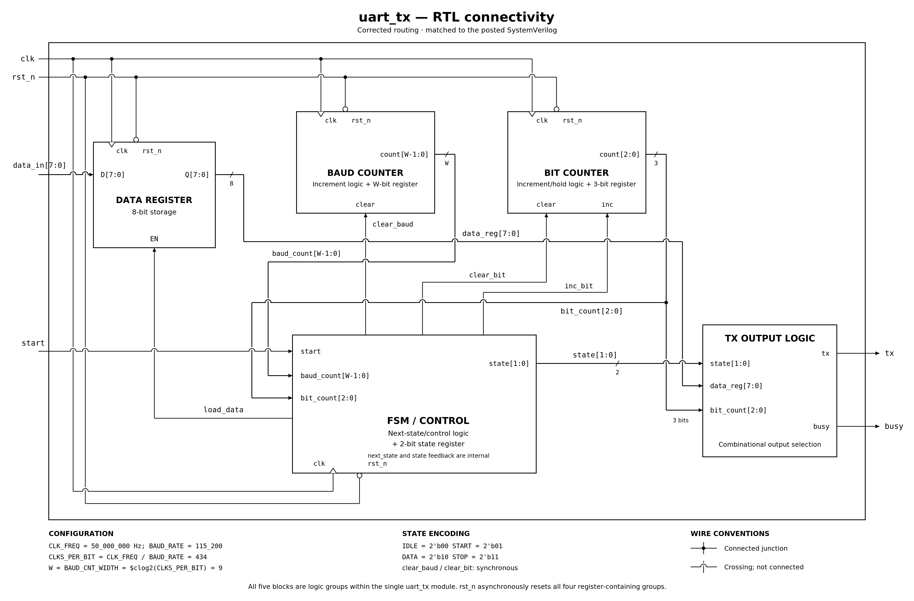
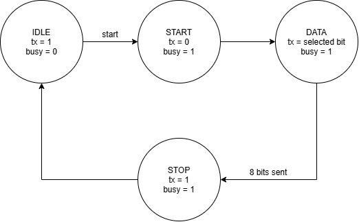
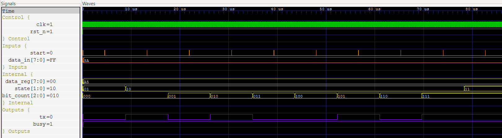

# UART Transmitter

A parameterized UART transmitter implemented in SystemVerilog to learn serial communication, baud-rate timing, finite-state-machine design, RTL organization, and hardware verification.

The design accepts an 8-bit parallel data value and transmits it serially using a standard 8-N-1 UART frame.

## Specifications

- Simplex transmit-only UART
- 8 data bits
- No parity
- 1 stop bit
- LSB-first transmission
- Configurable system clock frequency
- Configurable baud rate
- Active-low asynchronous reset
- Busy status output

### Default Configuration

| Parameter | Value |
| --- | --- |
| Clock Frequency | 50 MHz |
| Baud Rate | 115200 |
| Clocks per Bit | 434 |

## Module Interface

| Signal | Direction | Width | Description |
| --- | --- | ---: | --- |
| `clk` | Input | 1 | System clock |
| `rst_n` | Input | 1 | Active-low asynchronous reset |
| `start` | Input | 1 | Starts transmission of `data_in` |
| `data_in` | Input | 8 | Parallel byte to transmit |
| `tx` | Output | 1 | UART serial transmit line |
| `busy` | Output | 1 | High while a frame is being transmitted |

## UART Frame

Each transmission consists of:

```text
Idle | Start | D0 | D1 | D2 | D3 | D4 | D5 | D6 | D7 | Stop
  1  |   0   |                Data                |  1
```

The eight data bits are transmitted least-significant-bit first.

## RTL Architecture

The transmitter is implemented as a single SystemVerilog module containing a data register, baud counter, bit counter, FSM/control logic, and TX output logic.

The data register captures the input byte when a transmission begins and holds it for the duration of the frame. The baud counter controls the duration of each UART bit, while the bit counter selects the current data bit during the `DATA` state.



## State Machine

The transmitter uses four states:

- `IDLE` — waits for a transmission request with `tx` held high
- `START` — transmits the low start bit
- `DATA` — transmits the eight stored data bits LSB-first
- `STOP` — transmits the high stop bit



## Verification

The design is verified with a self-checking SystemVerilog testbench.

The testbench verifies idle behavior, start- and stop-bit timing, LSB-first transmission, `busy` behavior, multiple data patterns, input changes while a frame is active, requests while busy, held `start` behavior, and asynchronous reset during the `START`, `DATA`, and `STOP` states.

The complete test suite passes 13 UART frames.

```text
PASS: all UART transmitter tests passed (13 complete frames)
```

At the default configuration:

```text
434 clocks per bit
4340 clocks per 8-N-1 frame
```

### Simulation Waveform

The waveform below shows a complete UART transmission along with the captured data, FSM state, bit counter, serial output, and busy status.



## Running the Simulation

Compile the RTL and testbench using Icarus Verilog:

```bash
iverilog -g2012 -o uart_tx_sim rtl/uart_tx.sv tb/tb_uart_tx.sv
```

Run the simulation:

```bash
vvp uart_tx_sim
```

Open the generated waveform in GTKWave:

```bash
gtkwave uart_tx.vcd
```

## Repository Structure

```text
uart-transmitter/
├── docs/
│   ├── uart_tx_fsm.png
│   ├── uart_tx_rtl.png
│   └── uart_tx_waveform.png
├── rtl/
│   └── uart_tx.sv
├── tb/
│   └── tb_uart_tx.sv
└── README.md
```

## Tools

- SystemVerilog
- Icarus Verilog
- GTKWave